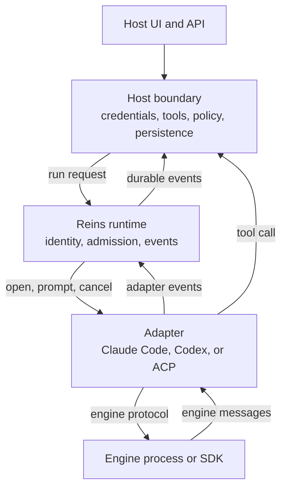
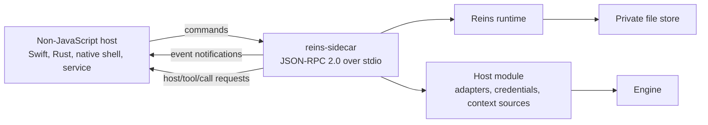

# Architecture

Reins separates two concerns. Your host owns the product. An engine owns the
agent behavior. The runtime is the contract between them.

Read [the glossary](GLOSSARY.md) first. This page uses those terms exactly.

## The pieces

| Piece | What it does | Who writes it |
| --- | --- | --- |
| Host | Renders the product, holds credentials, and owns domain data. | You |
| Runtime | Assigns run and turn identity. Appends events. Owns terminal events. | Reins |
| Adapter | Translates one engine into the runtime contract. | Reins or you |
| Engine | Produces the agent behavior. Claude Code, Codex, or an ACP agent. | The engine vendor |
| Sidecar | Exposes the runtime over JSON-RPC 2.0 to a host outside Node.js. | Reins |
| Persistence | Stores events and sessions. | You |

## How the pieces connect

The runtime never talks to an engine. The adapter never assigns identity. The
host never sees an engine SDK type.

## The sidecar path

A host that does not run JavaScript uses the sidecar. The runtime, the
adapters, and the ownership rules stay the same.

The sidecar is not a second runtime. It does not reinterpret engine events. It
resolves admission, calls the runtime, and streams the exact persisted events.

No command carries a credential, an engine SDK object, a database handle, or a
callback. Those stay inside the host module.

## The life of one turn

Follow these steps in order. Steps 1 to 4 run before the engine starts.

1. The host reads discovery data: capabilities, engine profile, model catalog,
   and limits.
2. The host builds a run request from the values a person selected.
3. Admission validates every selected value against fresh discovery data. A
   stale value fails here, not inside the engine.
4. The runtime copies the admitted request. Later changes to the caller's
   objects cannot affect the turn.
5. The runtime allocates the run id and the turn id.
6. The runtime prepares every context source for this turn.
7. The runtime reserves the session and opens or resumes the adapter session.
8. The runtime appends `turn-started`.
9. The adapter sends the prompt to the engine.
10. The adapter yields events. The runtime projects, appends, and then
    publishes each one.
11. The engine may call a tool. The call reaches the host through the tool
    host, with policy and validation first.
12. The engine may ask for permission. The adapter raises an interaction and
    waits for `run.respond`.
13. The adapter writes a checkpoint as soon as the engine session is
    resumable.
14. The turn ends, fails, or is canceled.
15. The runtime invalidates any open interaction.
16. The runtime appends `turn-completed` and seals the stream.

A canceled turn follows the same path. The runtime dispatches the cancel,
drains the engine turn, and then seals the terminal envelope. Events that the
adapter yields while it settles are still durable.

## What the package owns

- Engine-neutral run and session identity.
- Streamed events and one terminal result per turn.
- Application tools and engine permission interactions.
- Model, effort, permission, control, input, and limit discovery.
- Codex Fast as a generic model control.
- Steering, replacement, cancellation, replay, and resume checkpoints.
- Trusted host instructions and untrusted host context.
- Conformance tests for adapters and lifecycle behavior.
- A Node.js API and a versioned sidecar protocol.

## What the host owns

- Credentials and engine accounts.
- Process launch and the exact child environment.
- Filesystem, network, shell, sandbox, and approval policy.
- Product data, authorization, confirmation, and persistence choices.
- Uploads, draft storage, notifications, and the user interface.

## Design rules

These rules explain most decisions in the reference sections.

| Rule | Consequence |
| --- | --- |
| Engine identifiers are open strings. | The core has no `if engine === ...` branch and no closed engine enum. |
| Optional behavior is discovery data. | A host reads a capability instead of guessing from a name. |
| Unsupported is a value. | An absent feature returns `unsupported`. It never returns an empty or invented value. |
| Private by default. | Engine tool input, tool output, and error text enter an event only after the host selects a safe form. |
| Append before publish. | Live state and replay cannot disagree. |
| The runtime is not a sandbox. | A capability describes engine behavior. It grants no authority. |

## Reference sections

Each page below covers one area in full detail.

- [Events and the protocol](architecture/events.md) covers event envelopes,
  sequence assignment, and extension projection.
- [Discovery and admission](architecture/discovery-and-admission.md) covers
  engine profiles, model catalogs, limits, inline context, and the admission
  resolver.
- [Runtime](architecture/runtime.md) covers session reuse, checkpoints,
  cancellation, steering, the turn queue, and diagnostics.
- [Tools and context](architecture/tools-and-context.md) covers the tool
  boundary, the MCP projection, and context sources.
- [Adapters](architecture/adapters.md) covers the adapter contract, the Claude
  Code adapter, the Codex adapter, the ACP v1 adapter, and conformance tests.
- [Sidecar and persistence](architecture/sidecar-and-persistence.md) covers the
  command boundary, the file store, and the Node.js connectors.

## Security boundary

The runtime is not an operating-system sandbox. Read [SECURITY.md](../SECURITY.md)
before you ship.

The host must do all of the following:

1. Build an explicit environment for every engine process.
2. Protect credentials and keep them out of events and diagnostics.
3. Scope every store by tenant and actor.
4. Decide whether a tool or a subprocess may reach the filesystem or the
   network.

The runtime redacts an arbitrary adapter error. Only a `HarnessAdapterError`
carries a message that the adapter marked safe to persist. A required context
failure follows the same rule: only a `HarnessContextSourceError` can supply
public failure text.

## Where to go next

- Build a first turn with the [Node quickstart](getting-started/node.md).
- Build a complete product with the
  [build an app guide](guides/build-an-app.md).
- Read the [FAQ](guides/faq.md) for auth, cost, and platform answers.
